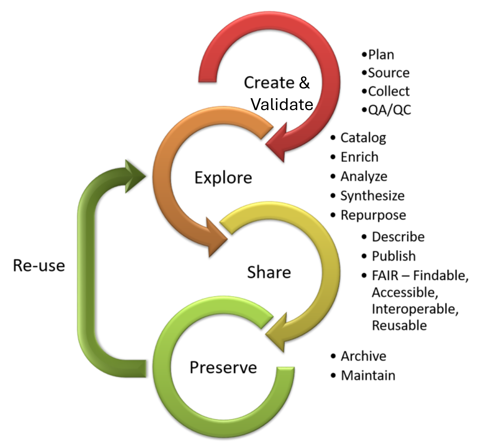

# Week 3
During week 3, we'll work on the first stage of the data life cycle: create & validate. We'll discuss best practices for data sourcing, collection, entry, and validation.

## Lecture 5 – Monday
- Describe the data life cycle (5 min)
- Discuss data sourcing considerations (15 min)
- Explore publicly-available environmental datasets (10 min)
- Write quality metadata (10 min)
- Learn Excel tips for data entry and validation (40 min)

## Lecture 6 – Wednesday
- Learn R functions and tips for quality assurance and quality control (20 min)
- Apply these functions and tips to an oceanographic dataset (60 min)

## Lab 3 – Thursday
- Clean messy data about Monarch butterfly populations (60 min)
- Generate figures and interpret findings (50 min)

Optional reading (outside of class):

[Advances in understanding the long-term population decline of monarch butterflies](https://github.com/Analytical-Workflows-for-Earth-Science/Sp2025/blob/main/Readings/Agrawal%20-%202019%20-%20Advances%20in%20understanding%20the%20long-term%20population.pdf)

[Why are monarch butterflies declining in the West? Understanding the importance of multiple correlated drivers](https://github.com/Analytical-Workflows-for-Earth-Science/Sp2025/blob/main/Readings/Crone%20et%20al.%20-%202019%20-%20Why%20are%20monarch%20butterflies%20declining%20in%20the%20West.pdf)

[Monarch butterfly population decline in North America: identifying the threatening processes](https://github.com/Analytical-Workflows-for-Earth-Science/Sp2025/blob/main/Readings/Thogmartin%20et%20al.%20-%202017%20-%20Monarch%20butterfly%20population%20decline%20in%20North%20Amer.pdf)

